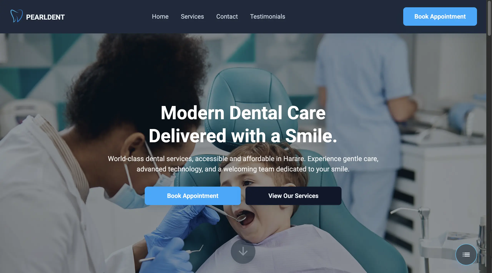
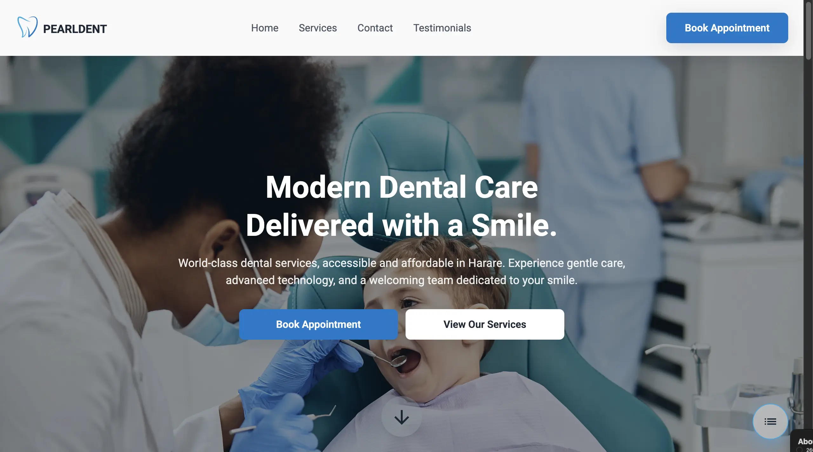
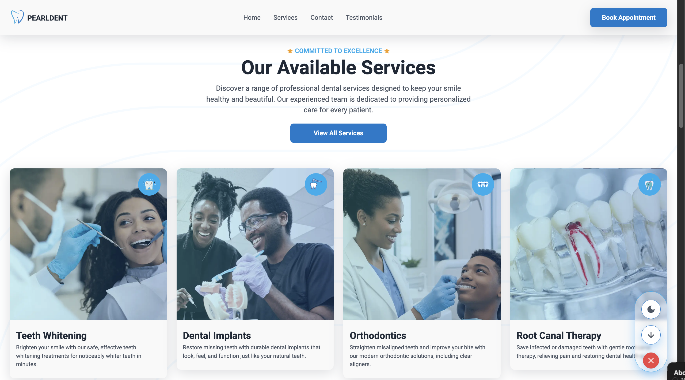
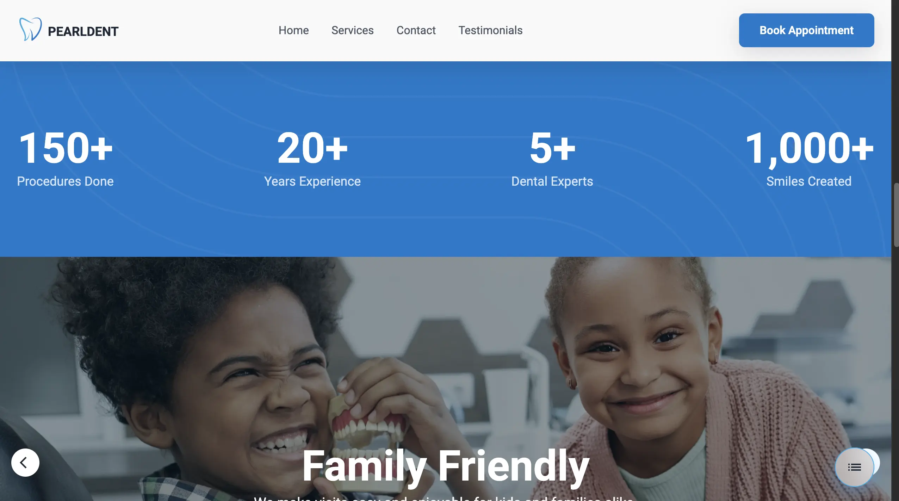
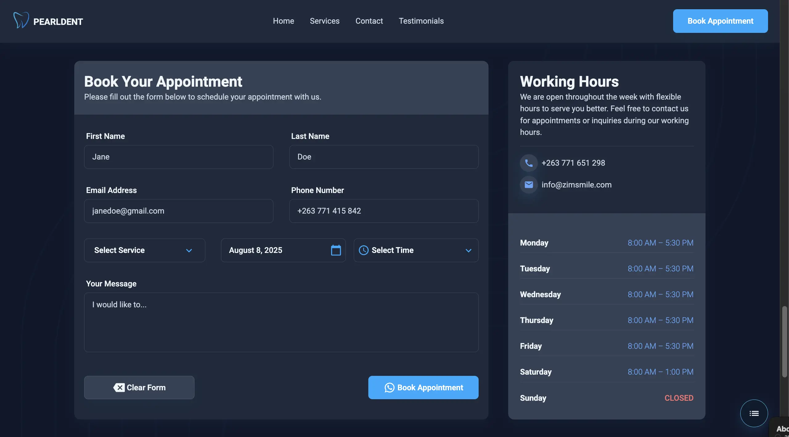

# 🦷 PearlDent - Dental Clinic Landing Page

A modern, responsive landing page for PearlDent dental clinic built with React, TypeScript, and Tailwind CSS. Features smooth animations, dark/light theme support, and a comprehensive appointment booking system.

## 📸 Screenshots

### 🌙 Dark Theme


### ☀️ Light Theme  


### 🦷 Services Section


### 📱 Gallery & Stats


### 📞 Contact Form


## 🌟 Features

### 🎨 Modern Design
- **Responsive Design**: Optimized for all device sizes with mobile-first approach
- **Dark/Light Theme**: Automatic theme detection with manual toggle option
- **Smooth Animations**: Framer Motion powered animations with reduced motion support
- **Interactive Gallery**: Swipeable image carousel with responsive image optimization

### 📱 Mobile Optimized
- **Responsive Images**: Separate mobile and desktop image assets for optimal performance
- **Mobile Menu**: Collapsible navigation for mobile devices

### 🔧 Functionality
- **Appointment Booking**: Complete form with date/time selection and service preferences
- **Form Validation**: Real-time validation with user-friendly error messages
- **Smooth Scrolling**: Navigation with smooth scroll to sections
- **Stats Counter**: Animated counters for clinic achievements
- **Client Testimonials**: Rotating testimonial carousel

### ⚡ Performance
- **Optimized Images**: WebP format with responsive loading
- **Code Splitting**: Component-based architecture for efficient loading
- **Modern Build**: Vite for fast development and optimized production builds

## 🔧 Tech Stack

- **Frontend**: React 19 + TypeScript
- **Styling**: Tailwind CSS v4
- **Animations**: Framer Motion
- **Icons**: Material-UI Icons
- **Build Tool**: Vite
- **Deployment**: GitHub Pages

## 📁 Project Structure

```
src/
├── assets/
│   └── images/
│       ├── pattern-left.svg
│       ├── pattern-right.svg
│       ├── stats-pattern.svg
│       └── ui-deco.png
├── components/
│   ├── Buttons/
│   │   ├── ControlsButton.tsx
│   │   ├── FloatingButton.tsx
│   │   ├── FormButton.tsx
│   │   ├── PaginationDots.tsx
│   │   ├── ScrollButton.tsx
│   │   └── ThemeButton.tsx
│   ├── Alert.tsx
│   ├── AnimatedCounter.tsx
│   ├── AnimationWrappers.tsx
│   ├── CTALink.tsx
│   ├── DateTimeSelector.tsx
│   ├── DropDown.tsx
│   ├── InputTextField.tsx
│   ├── Stats.tsx
│   ├── TextAreaField.tsx
│   └── TimeSelector.tsx
├── context/
│   ├── AlertContext.tsx
│   └── ThemeContext.tsx
├── data/
│   ├── footerData.ts
│   ├── galleryData.ts
│   ├── servicesData.ts
│   ├── testimonialData.ts
│   └── workingHours.ts
├── hooks/
│   ├── useDarkModeToggle.ts
│   └── useReducedMotion.ts
├── sections/
│   ├── Contact/
│   │   ├── Contact.tsx
│   │   ├── Form.tsx
│   │   └── WorkingHours.tsx
│   ├── Footer/
│   │   └── Footer.tsx
│   ├── Gallery/
│   │   └── Gallery.tsx
│   ├── Header/
│   │   └── Navbar.tsx
│   ├── Hero/
│   │   └── Hero.tsx
│   ├── Services/
│   │   └── Services.tsx
│   └── Testimonials/
│       └── Testimonials.tsx
├── styles/
│   └── datepicker.css
├── types/
│   ├── alert.ts
│   ├── contact.ts
│   └── theme.ts
├── utils/
│   └── timeFormatter.ts
├── App.css
├── App.tsx
├── index.css
├── main.tsx
├── variants.ts
└── vite-env.d.ts
```


## 🚀 Getting Started

### Prerequisites
- Node.js 18+ 
- npm or yarn

### Installation

1. **Clone the repository**
   ```bash
   git clone https://github.com/VictorKevz/dental-clinic-starter.git
   cd dental-clinic-starter
   ```

2. **Install dependencies**
   ```bash
   npm install
   ```

3. **Start development server**
   ```bash
   npm run dev
   ```

4. **Open in browser**
   Navigate to `http://localhost:5173`

### Build for Production

```bash
npm run build
```

### Deploy to GitHub Pages

```bash
npm run deploy
```

## 🎯 Key Sections

### 🏠 Hero Section
- Eye-catching banner with call-to-action
- Smooth animations on load
- Mobile-optimized background images

### 🦷 Services
- Interactive service cards with hover effects
- Service icons and detailed descriptions
- Smooth scroll navigation to booking

### 📸 Gallery
- Responsive image loading (mobile/desktop variants)
- Auto-play with pause on hover
- Touch gesture support

### 💬 Testimonials
- Rotating client testimonials
- Star ratings display
- Pagination controls

### 📞 Contact & Booking
- **Comprehensive appointment form**:
  - Personal information fields
  - Service selection (multiple services supported)
  - Date picker with availability
  - Time slot selection
  - Message/notes field
- **Real-time validation**
- **Working hours display**
- **Contact information**

## 🎨 Customization

### Theme Customization
The app uses CSS custom properties for theming:

```css
:root {
  --color-bg: #ffffff;
  --color-bg-secondary: #f8fafc;
  --color-text-primary: #1e293b;
  --color-accent: #3b82f6;
  --color-warning: #f59e0b;
  /* ... */
}
```

### Adding New Services
Update `src/data/servicesData.ts`:

```typescript
{
  id: "newService",
  title: "New Service",
  description: "Service description",
  cover: "/services/covers/new-service.webp",
  icon: "/services/icons/new-service.png"
}
```

### Gallery Images
Add images to `src/data/galleryData.ts` with both desktop and mobile variants:

```typescript
{
  title: "Image Title",
  description: "Image description",
  image: "/gallery/desktop-image.webp",
  mobileImage: "/gallery/mobile-image.webp"
}
```

## 📱 Responsive Design

- **Desktop**: Full layout with side-by-side content
- **Tablet**: Adjusted spacing and font sizes
- **Mobile**: Single column layout, collapsible navigation
- **Gallery**: Responsive images with mobile/desktop variants

## ♿ Accessibility

- Semantic HTML structure
- ARIA labels and descriptions
- Keyboard navigation support
- Reduced motion preferences respected
- High contrast theme options

## 🚀 Performance Optimizations

- **Image Optimization**: WebP format with responsive variants
- **Code Splitting**: Component-based lazy loading
- **Animation Optimization**: Hardware acceleration and reduced motion support
- **Bundle Optimization**: Tree shaking and minification

## 📄 License

MIT License - see LICENSE file for details.


## 🤝 Contributing

1. Fork the project
2. Create a feature branch (`git checkout -b feature/amazing-feature`)
3. Commit changes (`git commit -m 'Add amazing feature'`)
4. Push to branch (`git push origin feature/amazing-feature`)
5. Open a Pull Request

## 📞 Support

Built with ❤️ by [VictorKevz](https://chatbot.victorkevz.com/)